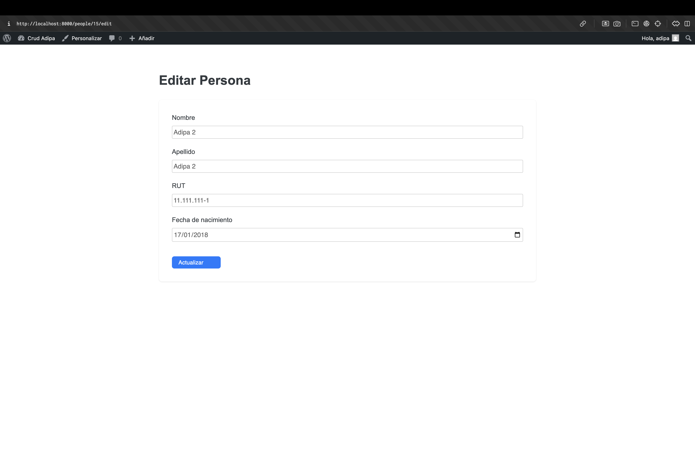

# Themosis Person CRUD Application

Este proyecto es una aplicación construida con el framework [Themosis](https://framework.themosis.com/) sobre WordPress que implementa un CRUD completo para la entidad **Persona**, demostrando el patrón **MVC** (Modelo–Vista–Controlador) tanto en el front público como en el panel de administración de WordPress.  
Todas las vistas (públicas y de WP-Admin) residen en el tema activo bajo `content/themes/themosis/views/people/`.

---

## 🚀 Clona y prepara tu entorno

1. **Clona el repositorio**  
   ```bash
   git clone https://github.com/DillanDevs/themosis-crud.git
   cd themosis-crud
   ```

2. **Copia el archivo de ejemplo**
   ```bash
   cp .env.sample .env
   ```

3. **Abre .env y completa tus propias credenciales:**
   ```dotenv
   APP_ENV=local
   APP_DEBUG=true
   APP_KEY=                  # Genera una nueva: `docker-compose exec app php artisan key:generate --show`
   AUTH_KEY=
   SECURE_AUTH_KEY=
   LOGGED_IN_KEY=
   NONCE_KEY=
   AUTH_SALT=
   SECURE_AUTH_SALT=
   LOGGED_IN_SALT=
   NONCE_SALT=

   APP_URL=http://localhost:8000
   WP_URL=http://localhost:8000/cms

   DATABASE_HOST=mysql
   DATABASE_PORT=3306
   DATABASE_NAME=themosis
   DATABASE_USER=themosis_user
   DATABASE_PASSWORD=themosis_pass
   DATABASE_PREFIX=th_
   ```

4. **Genera tus salts** (elige uno de estos métodos):
   - Con Artisan:
     ```bash
     docker-compose exec app php artisan salts:generate
     ```
   - Con el generador oficial de WordPress:
     ```bash
     curl https://api.wordpress.org/secret-key/1.1/salt/ >> .env
     ```

## 📦 Levanta todo con Docker

1. **Inicia los contenedores**
   ```bash
   docker-compose up -d
   ```
   - MySQL en localhost:3306
   - phpMyAdmin en http://localhost:8080
   - Nginx + PHP-FPM en http://localhost:8000

2. **Instala dependencias PHP** (si aún no se instalan automáticamente)
   ```bash
   docker-compose exec app composer install
   ```

3. **Ejecuta las migraciones**
   ```bash
   docker-compose exec app php artisan migrate
   ```

4. **Configura WordPress**
   
   Abre http://localhost:8000 en tu navegador y sigue el asistente para crear el usuario administrador.

## 🔗 URLs disponibles

### CRUD público
- http://localhost:8000/people
  — Listado y formularios en frontend (requiere admin).

### CRUD en WP-Admin
- **Listado:**
  http://localhost:8000/cms/wp-admin/admin.php?page=people-admin
- **Crear/Editar:**
  http://localhost:8000/cms/wp-admin/admin.php?page=people-add

Nota: en ambos casos debes haber iniciado sesión como administrador de WordPress.

## 🗂 Estructura y MVC

- **Modelo:** `app/Models/Person.php`
- **Controlador:** `app/Http/Controllers/PersonController.php`
- **Vistas (tema):**
  - `content/themes/themosis/views/people/`
  - `index.blade.php`, `create.blade.php`, `edit.blade.php`, `_form.blade.php`, `admin-form.blade.php`
- **Rutas públicas:** `routes/web.php` (grupo con middleware admin)
- **Admin hooks:** `content/themes/themosis/inc/admin.php`

## 🔧 Características principales

- Validación de RUT en backend y en tiempo real (JS).
- Estilos modernos en `content/themes/themosis/style.css`.
- Columnas ordenables y paginación en WP-Admin.
- Protección de acceso con `manage_options`.

## 🔢 Ejemplos de RUT chilenos válidos

Para probar la funcionalidad de validación de RUT, puedes utilizar estos ejemplos válidos:

- 13.456.789-9
- 11.111.111-1
- 12.345.678-5

## 📸 Capturas de pantalla

### Vista pública del CRUD



*Interfaz frontend accesible desde http://localhost:8000/people*

### Panel de administración en WordPress


*Interfaz de administración en WordPress accesible desde http://localhost:8000/cms/wp-admin/admin.php?page=people-admin*